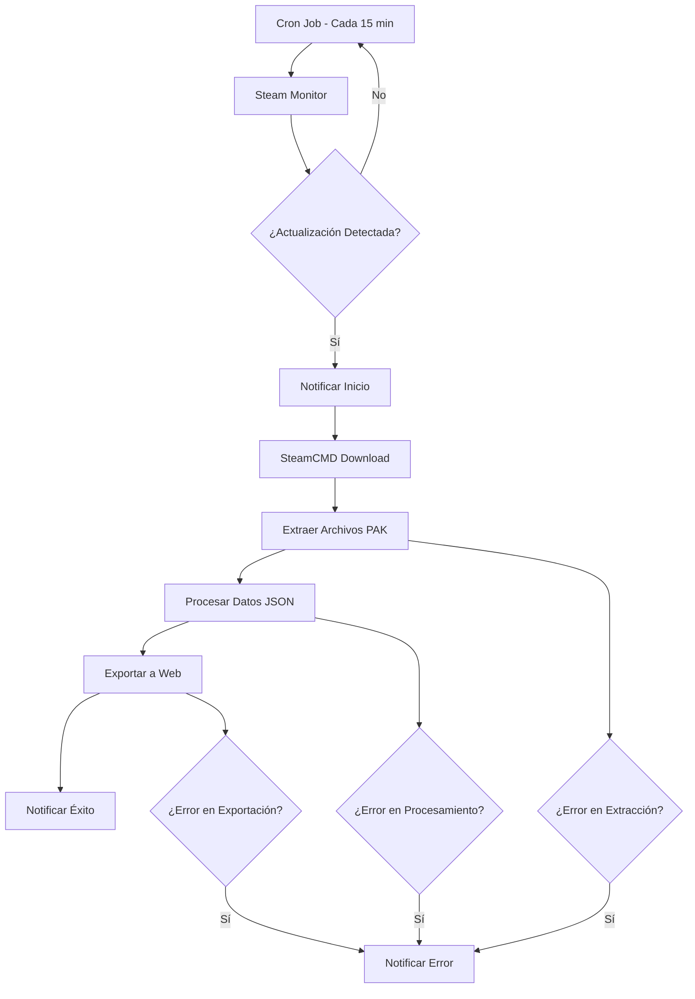

# Automatización de Flujo de Trabajo y CI/CD

## Resumen

Este documento complementa el plan principal de automatización definiendo los flujos de trabajo específicos y las integraciones de CI/CD para el proyecto loDataExtractor.

## Arquitectura del Flujo de Trabajo

### Flujo Principal de Automatización



## Configuración de CI/CD con GitHub Actions

### 1. Workflow Principal - Automatización Continua

**Archivo**: `.github/workflows/automation.yml`

```yaml
name: Last Oasis Data Automation

on:
  schedule:
    # Ejecutar cada 15 minutos
    - cron: '*/15 * * * *'
  workflow_dispatch: # Permitir ejecución manual
    inputs:
      force_extraction:
        description: 'Forzar extracción sin verificar actualizaciones'
        required: false
        default: 'false'

jobs:
  check-and-extract:
    runs-on: ubuntu-latest
    timeout-minutes: 60
    
    steps:
    - name: Checkout repository
      uses: actions/checkout@v4
      
    - name: Setup Node.js
      uses: actions/setup-node@v4
      with:
        node-version: '18'
        cache: 'npm'
        
    - name: Install dependencies
      run: npm ci
      
    - name: Setup SteamCMD
      run: |
        mkdir -p automation/steamcmd
        cd automation/steamcmd
        wget https://steamcdn-a.akamaihd.net/client/installer/steamcmd_linux.tar.gz
        tar -xvzf steamcmd_linux.tar.gz
        chmod +x steamcmd.sh
        
    - name: Run automation process
      env:
        STEAM_API_KEY: ${{ secrets.STEAM_API_KEY }}
        NOTIFICATION_WEBHOOK: ${{ secrets.NOTIFICATION_WEBHOOK }}
        FORCE_EXTRACTION: ${{ github.event.inputs.force_extraction }}
      run: npm run automation
      
    - name: Upload logs on failure
      if: failure()
      uses: actions/upload-artifact@v4
      with:
        name: automation-logs
        path: logs/
        retention-days: 7
        
    - name: Notify on failure
      if: failure()
      run: |
        curl -X POST ${{ secrets.NOTIFICATION_WEBHOOK }} \
        -H 'Content-Type: application/json' \
        -d '{"text":"❌ Last Oasis automation failed - Check logs"}'
```

### 2. Workflow de Desarrollo - Testing y Validación

**Archivo**: `.github/workflows/test.yml`

```yaml
name: Test and Validate

on:
  push:
    branches: [ main, develop ]
  pull_request:
    branches: [ main ]

jobs:
  test:
    runs-on: ubuntu-latest
    
    strategy:
      matrix:
        node-version: [16, 18, 20]
        
    steps:
    - uses: actions/checkout@v4
    
    - name: Use Node.js ${{ matrix.node-version }}
      uses: actions/setup-node@v4
      with:
        node-version: ${{ matrix.node-version }}
        cache: 'npm'
        
    - run: npm ci
    - run: npm run lint
    - run: npm run test
    - run: npm run format:check
    
    - name: Test automation components
      run: npm run test:automation
```

### 3. Workflow de Despliegue

**Archivo**: `.github/workflows/deploy.yml`

```yaml
name: Deploy to Production

on:
  push:
    tags:
      - 'v*'

jobs:
  deploy:
    runs-on: ubuntu-latest
    
    steps:
    - uses: actions/checkout@v4
    
    - name: Build Docker image
      run: |
        docker build -t lodataextractor:${{ github.ref_name }} .
        docker tag lodataextractor:${{ github.ref_name }} lodataextractor:latest
        
    - name: Deploy to server
      run: |
        # Script de despliegue específico del servidor
        echo "Deploying to production server..."
```

## Configuración Docker

### Dockerfile

```dockerfile
FROM node:18-alpine

# Instalar dependencias del sistema
RUN apk add --no-cache \
    wget \
    tar \
    gzip \
    bash \
    curl

# Crear directorio de trabajo
WORKDIR /app

# Copiar archivos de dependencias
COPY package*.json ./

# Instalar dependencias de Node.js
RUN npm ci --only=production

# Copiar código fuente
COPY . .

# Crear directorios necesarios
RUN mkdir -p automation/steamcmd logs temp exported

# Configurar SteamCMD
RUN cd automation/steamcmd && \
    wget https://steamcdn-a.akamaihd.net/client/installer/steamcmd_linux.tar.gz && \
    tar -xvzf steamcmd_linux.tar.gz && \
    chmod +x steamcmd.sh && \
    rm steamcmd_linux.tar.gz

# Exponer puerto para monitoreo (opcional)
EXPOSE 3000

# Comando por defecto
CMD ["npm", "run", "automation"]
```

### docker-compose.yml

```yaml
version: '3.8'

services:
  lodataextractor:
    build: .
    container_name: lodataextractor
    restart: unless-stopped
    environment:
      - NODE_ENV=production
      - STEAM_API_KEY=${STEAM_API_KEY}
      - NOTIFICATION_WEBHOOK=${NOTIFICATION_WEBHOOK}
    volumes:
      - ./logs:/app/logs
      - ./exported:/app/exported
      - ./temp:/app/temp
      - steam_data:/app/automation/steamcmd/steamapps
    networks:
      - automation_network

  # Opcional: Servicio de monitoreo
  monitoring:
    image: prom/prometheus:latest
    container_name: prometheus
    ports:
      - "9090:9090"
    volumes:
      - ./monitoring/prometheus.yml:/etc/prometheus/prometheus.yml
    networks:
      - automation_network

volumes:
  steam_data:

networks:
  automation_network:
    driver: bridge
```

## Scripts de Automatización

### package.json - Scripts Adicionales

```json
{
  "scripts": {
    "start": "node index.js",
    "automation": "node automation/orchestrator.js",
    "automation:dev": "NODE_ENV=development node automation/orchestrator.js",
    "steam:check": "node automation/scripts/checkSteamUpdates.js",
    "extract:manual": "node automation/scripts/manualExtraction.js",
    "test": "jest",
    "test:automation": "jest automation/",
    "lint": "biome check .",
    "format": "biome format --write .",
    "format:check": "biome format .",
    "docker:build": "docker build -t lodataextractor .",
    "docker:run": "docker-compose up -d",
    "docker:logs": "docker-compose logs -f",
    "docker:stop": "docker-compose down"
  }
}
```

### Script de Orquestación Principal

**Archivo**: `automation/orchestrator.js`

```javascript
const { SteamMonitor } = require('./services/steamMonitor');
const { GameExtractor } = require('./services/gameExtractor');
const { AutomatedProcessor } = require('./services/automatedProcessor');
const { NotificationService } = require('./services/notificationService');
const logger = require('./utils/logger');

class GameUpdateOrchestrator {
    constructor() {
        this.steamMonitor = new SteamMonitor();
        this.gameExtractor = new GameExtractor();
        this.processor = new AutomatedProcessor();
        this.notifier = new NotificationService();
    }

    async run() {
        try {
            logger.info('🚀 Iniciando proceso de automatización');
            
            // Verificar actualizaciones de Steam
            const updateInfo = await this.steamMonitor.checkForUpdates();
            
            if (!updateInfo.hasUpdate && !process.env.FORCE_EXTRACTION) {
                logger.info('✅ No hay actualizaciones disponibles');
                return;
            }

            if (updateInfo.hasUpdate) {
                await this.notifier.notifyUpdateDetected(updateInfo);
                logger.info(`🎮 Nueva actualización detectada: ${updateInfo.buildId}`);
            }

            // Extraer archivos del juego
            logger.info('📦 Iniciando extracción de archivos del juego');
            const extractionResult = await this.gameExtractor.extractGameFiles();
            
            if (!extractionResult.success) {
                throw new Error(`Error en extracción: ${extractionResult.error}`);
            }

            // Procesar datos extraídos
            logger.info('⚙️ Procesando datos extraídos');
            const processingResult = await this.processor.processExtractedData();
            
            if (!processingResult.success) {
                throw new Error(`Error en procesamiento: ${processingResult.error}`);
            }

            // Notificar éxito
            await this.notifier.notifySuccess({
                updateInfo,
                extractionResult,
                processingResult
            });

            logger.info('✅ Proceso de automatización completado exitosamente');

        } catch (error) {
            logger.error('❌ Error en proceso de automatización:', error);
            await this.notifier.notifyError(error);
            process.exit(1);
        }
    }
}

// Ejecutar si es llamado directamente
if (require.main === module) {
    const orchestrator = new GameUpdateOrchestrator();
    orchestrator.run();
}

module.exports = { GameUpdateOrchestrator };
```

## Configuración de Monitoreo

### Prometheus Configuration

**Archivo**: `monitoring/prometheus.yml`

```yaml
global:
  scrape_interval: 15s

scrape_configs:
  - job_name: 'lodataextractor'
    static_configs:
      - targets: ['lodataextractor:3000']
    scrape_interval: 30s
    metrics_path: '/metrics'
```

### Métricas de Aplicación

**Archivo**: `automation/utils/metrics.js`

```javascript
const client = require('prom-client');

// Crear registro de métricas
const register = new client.Registry();

// Métricas personalizadas
const extractionDuration = new client.Histogram({
    name: 'extraction_duration_seconds',
    help: 'Duración del proceso de extracción',
    buckets: [1, 5, 15, 30, 60, 300, 600]
});

const extractionSuccess = new client.Counter({
    name: 'extraction_success_total',
    help: 'Número total de extracciones exitosas'
});

const extractionErrors = new client.Counter({
    name: 'extraction_errors_total',
    help: 'Número total de errores en extracción',
    labelNames: ['error_type']
});

const steamApiCalls = new client.Counter({
    name: 'steam_api_calls_total',
    help: 'Número total de llamadas a Steam API',
    labelNames: ['endpoint', 'status']
});

// Registrar métricas
register.registerMetric(extractionDuration);
register.registerMetric(extractionSuccess);
register.registerMetric(extractionErrors);
register.registerMetric(steamApiCalls);

// Métricas por defecto de Node.js
client.collectDefaultMetrics({ register });

module.exports = {
    register,
    extractionDuration,
    extractionSuccess,
    extractionErrors,
    steamApiCalls
};
```

## Configuración de Notificaciones

### Servicio de Notificaciones

**Archivo**: `automation/services/notificationService.js`

```javascript
const axios = require('axios');
const logger = require('../utils/logger');

class NotificationService {
    constructor() {
        this.webhookUrl = process.env.NOTIFICATION_WEBHOOK;
        this.emailConfig = {
            enabled: process.env.EMAIL_NOTIFICATIONS === 'true',
            // Configuración de email
        };
    }

    async notifyUpdateDetected(updateInfo) {
        const message = {
            text: `🎮 Nueva actualización de Last Oasis detectada!\n` +
                  `Build ID: ${updateInfo.buildId}\n` +
                  `Fecha: ${updateInfo.lastUpdated}\n` +
                  `Iniciando proceso de extracción...`
        };

        await this.sendNotification(message);
    }

    async notifySuccess(results) {
        const message = {
            text: `✅ Extracción de datos completada exitosamente!\n` +
                  `Archivos procesados: ${results.processingResult.filesProcessed}\n` +
                  `Tiempo total: ${results.processingResult.duration}s\n` +
                  `Datos exportados actualizados.`
        };

        await this.sendNotification(message);
    }

    async notifyError(error) {
        const message = {
            text: `❌ Error en automatización de Last Oasis:\n` +
                  `Error: ${error.message}\n` +
                  `Timestamp: ${new Date().toISOString()}\n` +
                  `Revisar logs para más detalles.`
        };

        await this.sendNotification(message);
    }

    async sendNotification(message) {
        try {
            if (this.webhookUrl) {
                await axios.post(this.webhookUrl, message);
                logger.info('Notificación enviada exitosamente');
            }
        } catch (error) {
            logger.error('Error enviando notificación:', error.message);
        }
    }
}

module.exports = { NotificationService };
```

## Variables de Entorno

### .env.example - Actualizado

```env
# Configuración existente
CONTENT_FOLDER_PATH="./Mist/"
EXPORT_FOLDER_PATH="./exported/"

# Nuevas configuraciones para automatización
STEAM_API_KEY="your_steam_api_key_here"
LAST_OASIS_APP_ID="903950"

# Configuración de notificaciones
NOTIFICATION_WEBHOOK="https://hooks.slack.com/services/YOUR/WEBHOOK/URL"
EMAIL_NOTIFICATIONS="false"

# Configuración de extracción
STEAMCMD_PATH="./automation/steamcmd/steamcmd.sh"
GAME_INSTALL_PATH="./temp/last_oasis/"
EXTRACTION_TIMEOUT="1800000"

# Configuración de monitoreo
CHECK_INTERVAL_MINUTES="15"
ENABLE_METRICS="true"
METRICS_PORT="3000"

# Configuración de desarrollo
NODE_ENV="production"
LOG_LEVEL="info"
FORCE_EXTRACTION="false"
```

## Comandos de Gestión

### Scripts de Utilidad

**Archivo**: `automation/scripts/management.js`

```javascript
#!/usr/bin/env node

const { program } = require('commander');
const { SteamMonitor } = require('../services/steamMonitor');
const { GameExtractor } = require('../services/gameExtractor');

program
  .name('lo-automation')
  .description('Herramientas de gestión para automatización de Last Oasis')
  .version('1.0.0');

program
  .command('check-update')
  .description('Verificar si hay actualizaciones disponibles')
  .action(async () => {
    const monitor = new SteamMonitor();
    const result = await monitor.checkForUpdates();
    console.log('Resultado:', result);
  });

program
  .command('force-extract')
  .description('Forzar extracción sin verificar actualizaciones')
  .action(async () => {
    const extractor = new GameExtractor();
    const result = await extractor.extractGameFiles();
    console.log('Resultado:', result);
  });

program
  .command('status')
  .description('Mostrar estado del sistema')
  .action(async () => {
    // Mostrar estado de servicios, última extracción, etc.
    console.log('Estado del sistema...');
  });

program.parse();
```

## Conclusión

Esta configuración de automatización y CI/CD proporciona:

1. **Automatización completa** del flujo de trabajo
2. **Integración continua** con GitHub Actions
3. **Containerización** con Docker para consistencia
4. **Monitoreo** con métricas y notificaciones
5. **Gestión** con scripts de utilidad

El sistema está diseñado para ser robusto, escalable y fácil de mantener, con capacidades de recuperación ante errores y monitoreo continuo del estado del proceso.